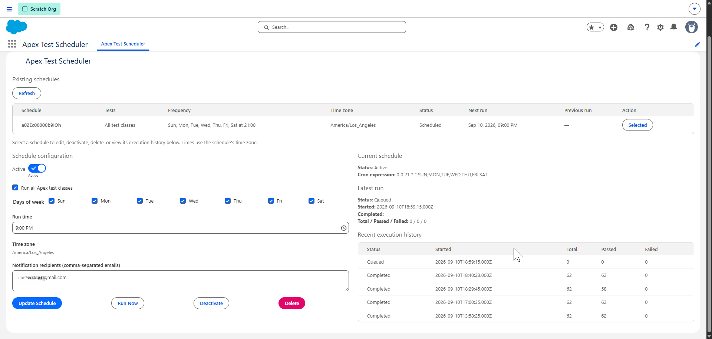

# Apex Test Scheduler

A Salesforce Lightning app for scheduling Apex test runs, running tests on demand, and reviewing execution results. Built with Lightning Web Components and Apex, with source managed as a Salesforce DX project.

## Features

- Run all discovered Apex test classes or select individual classes.
- Schedule recurring runs by weekday and time.
- View saved schedules in a table with test scope, frequency, time zone, job status, and next/previous run times.
- Select a schedule to update its configuration, run it now, deactivate it, or delete it.
- View the latest run and the five most recent executions for the selected schedule, including test counts and failure details.
- Send completion summaries to comma-separated notification recipients.
- Include org-wide code coverage when the optional Tooling API connection is configured.
- Prevent overlapping runs for the same schedule and attempt recovery of stale runs when another run is requested.



## Requirements

- [Salesforce CLI](https://developer.salesforce.com/tools/salesforcecli).
- A Salesforce development org or sandbox supporting the project's API version, currently **67.0** in `sfdx-project.json`.
- Node.js and npm for local development, formatting, and LWC tests. Node.js 24 has been used with this project.
- A Dev Hub if you want to create scratch orgs.
- A user with permission to deploy metadata and administer Apex tests and scheduled jobs. Assign the included **Test Scheduler Admin** permission set to app users; platform permissions required by their profile must also be available.

## Install in a development org

Clone the repository and install development dependencies:

```sh
git clone https://github.com/robtdavis/test-class-scheduler.git
cd test-class-scheduler
npm ci
```

Authorize your target org, deploy the source, and assign the permission set. Replace `TestSchedulerOrg` with your preferred alias:

```sh
sf org login web --alias TestSchedulerOrg
sf project deploy start --source-dir force-app --target-org TestSchedulerOrg --test-level RunLocalTests --wait 20
sf org assign permset --name Test_Scheduler_Admin --target-org TestSchedulerOrg
sf org open --target-org TestSchedulerOrg --path /lightning/n/Apex_Test_Scheduler
```

For a sandbox, add `--instance-url https://test.salesforce.com` to the login command.

### Optional: create a scratch org

Use this instead of authorizing an existing target org. The Dev Hub must already be enabled:

```sh
sf org login web --alias DevHub --set-default-dev-hub
sf org create scratch --definition-file config/project-scratch-def.json --alias TestSchedulerOrg --target-dev-hub DevHub --duration-days 7 --wait 10
```

Then run the deployment, permission assignment, and open commands above.

## Use the app

1. Open **Apex Test Scheduler** from the Salesforce App Launcher.
2. Select an existing row, or configure the initial schedule if none exists.
3. Choose **Run all Apex test classes**, or search for and select specific classes.
4. Select weekdays, a run time, and notification recipients.
5. Turn **Active** on for recurring execution and save the schedule.
6. Use **Run Now** to start a test run immediately. A saved inactive schedule can also be run manually.
7. Use **Refresh** to reload the schedule list and execution history.

Schedule times use the time zone of the user saving an active schedule. The app displays that zone; it is not independently editable. Saving as a user in a different zone can change the schedule's time zone.

**Deactivate** cancels future scheduled execution while retaining the configuration. **Delete** cancels the linked job and removes the schedule record. These actions apply to the selected row; they do not cancel an already-running test execution.

The table supports selecting multiple existing schedule records. The current save service still reuses the first saved schedule when no schedule ID is supplied, so the UI does not offer a separate **New Schedule** action.

## Email setup and troubleshooting

Before testing completion notifications:

- Set **Setup → Deliverability → Access level** to **All email**.
- Verify the sending user's email address in the target org and satisfy Salesforce's applicable sender/domain verification requirements.
- Enter valid recipient addresses in the schedule before starting a run. Each run captures the recipients configured when it starts.

The current implementation uses the running user's sender address. It does not explicitly select an organization-wide email address; adding one alone does not change the sender used by this code.

**Current limitation:** `MessagingEmailGateway` calls `Messaging.sendEmail` without inspecting the returned results. The `Notification_Sent__c` flag and a debug-log send entry are therefore not proof of inbox delivery. Send-result diagnostics are not included in this version.

If a notification is missing, confirm that a new run completed after configuration or verification changes. Check spam filtering and request Salesforce email logs covering the run's completion time, accounting for time zones. Preserve any delivery or rejection details for diagnosis. See [Salesforce email requirements](https://help.salesforce.com/s/articleView?id=xcloud.security_email_verification_requirements.htm&language=en_US&type=5).

## Optional code coverage connection

Configure an authenticated Named Credential named **`TestSchedulerToolingApi`** pointing to the same org, with OAuth access to its Tooling API. Grant the calling user access to the credential's principal as required by your credential setup.

`ToolingApiCoverageGateway` queries `ApexOrgWideCoverage` through that connection. The credential is not provisioned by this repository. Without it, or if the callout fails, results report coverage as unavailable rather than zero. Test execution can still proceed.

## Development and validation

Run the local checks from the repository root:

```sh
npm run lint
npm run test:unit -- -- --runInBand
npm run prettier:verify
```

Run Apex tests in an authenticated org:

```sh
sf apex run test --target-org TestSchedulerOrg --test-level RunLocalTests --result-format human --wait 20
```

Apex unit tests use test doubles for external behavior. Passing unit tests does not demonstrate email delivery; verify notifications separately with an actual app run.

The pre-commit hook runs `lint-staged`, which formats staged source and runs relevant lint and LWC test checks. If a commit fails, inspect the first failed check in the output.

### Retrieving changes from Salesforce

```sh
sf project retrieve start --target-org TestSchedulerOrg --source-dir force-app
```

Review the retrieved changes before committing. LWC Jest tests in `__tests__` are local development files and are not retrieved from Salesforce. When an Apex method or component interface changes, update its test mocks in Git too. For example, the schedule table calls `TestSchedulerController.getSchedules`, and its mock must return an array (`[]` for no schedules).

### Updating code used by scheduled jobs

Salesforce can reject deployments of classes referenced by pending scheduled jobs. Record the active schedule configuration, deactivate the affected schedule, deploy and validate the update, and restore the schedule afterward. Confirm its active state, time zone, and next run even if deployment fails.

## How it works

| Component                                           | Responsibility                                                   |
| --------------------------------------------------- | ---------------------------------------------------------------- |
| `apexTestScheduler`                                 | LWC configuration form, schedule table, and execution history    |
| `TestSchedulerController`                           | Apex methods called by the LWC                                   |
| `TestSchedulerService` / `TestScheduleJob`          | Schedule lifecycle and recurring execution entry point           |
| `TestExecutionService` / `ApexTestQueueGateway`     | Enqueue Apex tests and create run records                        |
| `TestMonitoringService` / `TestRunMonitor`          | Poll for completion, collect results, and initiate notifications |
| `TestNotificationService` / `MessagingEmailGateway` | Build and send completion email                                  |
| `TestClassSelector` / `TestRunSelector`             | Query class metadata, schedules, and run results                 |
| `Test_Schedule__c`                                  | Saved schedule configuration and linked job ID                   |
| `Test_Schedule_Class__c`                            | Selected Apex classes for a schedule                             |
| `Test_Run__c`                                       | Execution status, counts, summaries, and notification flag       |

Monitoring checks are scheduled approximately two minutes apart. Runs still in flight after three hours are eligible for recovery when another run is requested. Salesforce scheduling and execution limits apply; exact start and completion times are not guaranteed.

Class discovery examines Apex class bodies for `@isTest` or `testMethod`; the search picker returns at most 200 matches. This is source-text discovery, not a complete Apex parser. The all-tests path is not limited to those 200 picker results.

## Unlocked Package URL

Production: https://login.salesforce.com/packaging/installPackage.apexp?p0=04tg8000000L5cbAAC

Sandbox: https://test.salesforce.com/packaging/installPackage.apexp?p0=04tg8000000L5cbAAC

## Contributing

Open an issue or pull request in [this repository](https://github.com/robtdavis/test-class-scheduler). Describe the change, add relevant Apex or LWC tests, and run the checks above. Keep credentials, authenticated frontdoor URLs, and org authentication files out of commits.

## License

Copyright (c) 2026 Robert Davis.

Licensed under the [MIT License](LICENSE). See the license file for permissions and warranty terms. Third-party dependencies retain their respective licenses.
